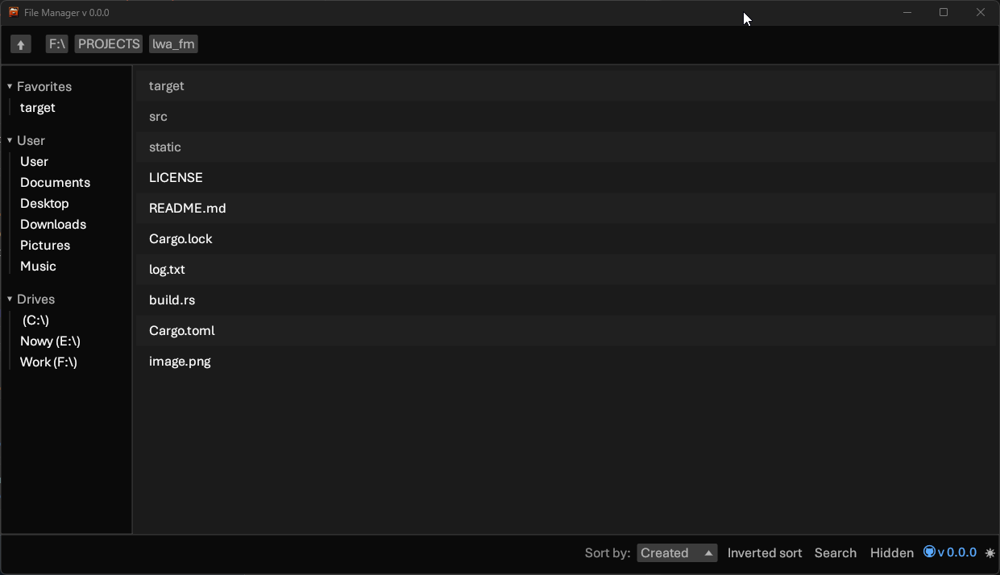

# lwa_fm

 

A (free) File Manager built with egui in Rust. Just a hobby, won't be big and ~~slow~~ professional like Finder or Windows Explorer.

## Contributing

Please feel free to open a PR!

When I doubt what can be contributed take a look on GitHub Issues.

Please keep PRs (reasonably) small and scoped.

## Contributors

Development requires Rust 1.95 or newer. Windows uses Fluent styling with the system accent (read at startup), Segoe UI and Cascadia Mono when available, and native rounded window/caption styling. The saved System/Light/Dark appearance setting is preserved; light/dark changes apply live.
